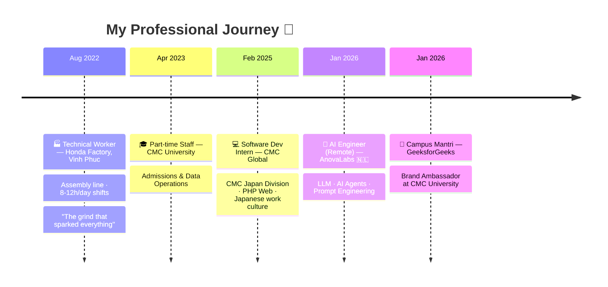

<div align="center">


[](https://git.io/typing-svg)

<br/>

[](http://linkedin.com/in/an-pham-097466261)
[](https://github.com/phamquocan24)
[](https://geeksforgeeks.org/profile/anpham25bmhu)
[](https://developers.google.com/profile/u/107078672472822652564)
[](https://credly.com/users/an-ph-m.0999a520)
[](mailto:anpham25052004@gmail.com)


</div>

---

## 🧑‍💻 About Me

```yaml
name        : Pham Quoc An (Phạm Quốc An)
born        : 2004  |  Nghe An, Vietnam 🇻🇳
role        : AI Engineer @ AnovaLabs (Netherlands 🇳🇱) — Remote
education   : B.Sc. Information Technology — Specialization: Artificial Intelligence
university  : CMC University  |  Graduated with Distinction (GPA: Excellent)
language    : Vietnamese (Native)  |  English (IELTS Academic)
goal        : Master's Degree at a top European University 🇪🇺
research    : Computer Vision · NLP · Deep Learning · Generative AI
```

> *"IT is not just dry lines of code — it is a tool to optimize human labor and create value for society."*

🏭 Started as a **factory worker at Honda** (Vinh Phuc) working 8–12 hour shifts — that grind became the fuel for an obsessive pursuit of technology through pure self-discipline and self-study.

🎓 Graduated **with Distinction** in AI from **CMC University**, published **2 international papers**, and won research awards at national level.

🤖 Now working as an **AI Engineer** (remote) for a Dutch startup — building LLM pipelines, AI Agents & Prompt Engineering systems.

🔬 Active researcher across **Computer Vision, NLP, Deep Learning, Generative AI, and MLOps**.

🌍 Currently exploring **Master's programs** at leading European universities.

---

## 🛠️ Tech Stack & Expertise

<div align="center">

### 🧠 AI / Machine Learning — Full Spectrum


### 👁️ Computer Vision


### 💬 NLP & Generative AI


### 📊 Data & Analytics


### ⚙️ MLOps & Cloud


### 💻 Software Development


</div>

---

## 💼 Career Timeline



---

## 🔬 Research & Publications

<table>
<tr>
<td width="55%" valign="top">

### 📚 Research Focus Areas

| Domain | Topics |
|--------|--------|
| **Computer Vision** | Deep Learning (YOLO, OCR), Table structure recognition, Document information extraction from images & PDFs |
| **NLP** | Toxic & non-standard language detection on social media |
| **Generative AI** | LLM applications, AI automation workflows |
| **Data Analysis** | Consumer behavior analytics, Big Data |

</td>
<td width="45%" valign="top">

### 📄 Publications

**🌐 International — ICAI-IP 2025**
> 2 papers accepted & published in proceedings
> [📖 View Proceedings](https://nxbtaichinh.vn/e-book/efph/ICAI_Proceedings_Optimized.html)

---

**🏛️ National — FAIR 2025**
> Invited to publish in special issue
> Hanoi University of Industry — Journal of Science & Technology Vol.61 No.11B (Nov 2025)
> [📖 View Journal](https://jst-haui.vn/vn/tap-chi-dien-tu/hanoi-university-of-industry-journal-of-science-and-technology-vol-61-no-11b-november-2025-electronic-version/65503) · [📄 PDF](https://jst-haui.vn/media/32/uffile-upload-no-title32356.pdf)

</td>
</tr>
</table>

---

## 🏆 Awards & Achievements

<div align="center">

| 🏅 Award | 📅 Year | 🏢 Organization |
|---------|---------|----------------|
| 🥉 **3rd Place** — University-level Scientific Research | 2025 | CMC University |
| 🏅 **Semi-finalist** — Euréka Student Research Award (27th edition) | 2025 | Vietnam Student Research Council |
| 🎯 **Round 2** — "Practical AI 2025" Competition | 2025 | National |
| 📡 Obtained **Shopee Open Platform API** access for academic research | 2025 | Shopee Vietnam |

</div>

---

## 📜 Certifications

<div align="center">


</div>

<details>
<summary><b>🔽 View Full Certification List (11+ certifications)</b></summary>

<br/>

| 🏢 Provider | 📜 Certification |
|------------|----------------|
| 🏫 **Samsung Innovation Campus** | Certificate of Excellence — AI (Machine Learning, Deep Learning & Practice) · Sep 2025 |
| 🟢 **NVIDIA** | Fundamentals of Deep Learning |
| 🟢 **NVIDIA** | Building LLM Applications with Prompt Engineering |
| 🔵 **Google** | [Data Analytics Professional Certificate](https://developers.google.com/profile/u/107078672472822652564) (8 courses + Capstone — Coursera) |
| 🔵 **Google** | Google Analytics Certification |
| 🔵 **Google** | Gemini Certified Faculty & Premium Teaching & Learning Features |
| 🔵 **Google** | Build AI with Agent Builder Camp |
| 🔵 **Google Cloud** | MLOps, GenAI, LLMs, Transformer Models, BERT, BigQuery ML (Cloud Skills Boost) |
| 🔴 **Oracle** | [OCI 2025 Certified AI Foundations Associate](https://credly.com/users/an-ph-m.0999a520) |
| 🟠 **AWS** | Solutions Architecture Job Simulation (via Forage) |
| 🔷 **Microsoft** | Microsoft Copilot for Productivity · What Is Generative AI? |

> 🔗 View all verified badges: [Credly Profile](https://credly.com/users/an-ph-m.0999a520) · [Google Developer Profile](https://developers.google.com/profile/u/107078672472822652564)

</details>

---

## 📊 GitHub Stats

<div align="center">


<br/>


<br/>


</div>

---

## 🐍 Contribution Snake

<div align="center">
<picture>
  <source media="(prefers-color-scheme: dark)" srcset="https://raw.githubusercontent.com/phamquocan24/phamquocan24/output/github-snake-dark.svg"/>
  <source media="(prefers-color-scheme: light)" srcset="https://raw.githubusercontent.com/phamquocan24/phamquocan24/output/github-snake.svg"/>
  
</picture>
</div>

---

## 🎯 Beyond the Code

- 🍳 **Home Chef** — The kitchen is my favorite place; cooking for friends is my best stress relief
- 📚 Former representative of the **Book & Action Club** — attended the 100th birth anniversary event of Polish poet **Wisława Szymborska** at Goethe Institut Hanoi
- 📱 Passionate about **consumer electronics & mobile tech**
- 👨‍👩‍👧‍👦 Family-oriented — deeply connected to the people who matter most

---

<div align="center">

### 💬 Let's Connect & Collaborate!

*Open to: AI/ML collaborations · Research partnerships · European Master's programs · Freelance AI projects*

**📧 anpham25052004@gmail.com**

[](http://linkedin.com/in/an-pham-097466261)
[](https://geeksforgeeks.org/profile/anpham25bmhu)
[](https://credly.com/users/an-ph-m.0999a520)

<br/>


<br/>


</div>
