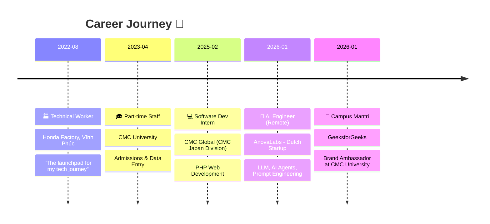

<div align="center">

<!-- HEADER -->


<!-- TYPING SVG -->
<a href="https://git.io/typing-svg"></a>

<br/>

<!-- SOCIAL BADGES -->
[](https://www.linkedin.com/in/phamquocan24/)
[](https://github.com/phamquocan24)
[](mailto:anpham25052004@gmail.com)


</div>

---

## 🧑‍💻 About Me

```yaml
name: Phạm Quốc An
born: 2004
location: Nghệ An, Vietnam 🇻🇳
role: AI Engineer @ AnovaLabs (Netherlands 🇳🇱)
education: B.Sc. in AI - CMC University (Graduated with Distinction)
goal: Pursuing Master's degree in Europe 🇪🇺
```

> *"IT không chỉ là những dòng code khô khan, mà là công cụ để tối ưu hóa sức lao động và tạo ra giá trị cho cộng đồng."*


🏭 Từng là **công nhân nhà máy Honda** với ca làm 8-12 tiếng/ngày — lấy đó làm động lực vươn lên bằng tự học và kỷ luật thép.

🎓 Tốt nghiệp **loại Giỏi** chuyên ngành Trí tuệ Nhân tạo tại **Đại học CMC**.

🤖 Hiện đang là **AI Engineer** làm việc từ xa cho startup Châu Âu — xây dựng AI Agents, LLM workflows & Prompt Engineering.

🔬 Đam mê nghiên cứu khoa học: **02 bài báo quốc tế** được chấp nhận tại ICAI-IP 2025.

🏆 **Giải Ba NCKH** cấp trường & **Top Bán kết Euréka lần 27**.

🌍 Đang tìm kiếm cơ hội **học Thạc sĩ tại Châu Âu**.

<br clear="both"/>

---

## 🛠️ Tech Stack

<div align="center">

### 🧠 AI & Machine Learning


### 📊 Data & Analytics


### 💻 Development & Tools


### ☁️ Cloud Platforms


</div>

---

## 💼 Experience



---

## 🏆 Honors & Research

<table>
<tr>
<td width="50%" valign="top">

### 🔬 Research Areas
- **Computer Vision**: Deep Learning (YOLO, OCR) cho nhận diện bảng biểu & trích xuất thông tin từ tài liệu
- **NLP**: Mô hình phân loại ngôn ngữ độc hại trên mạng xã hội

### 📄 Publications
- **02 bài báo quốc tế** - Kỷ yếu Hội nghị ICAI-IP 2025
- **01 bài báo** - Chuyên san đặc biệt ĐH Công nghiệp Hà Nội (FAIR 2025)

</td>
<td width="50%" valign="top">

### 🏅 Awards
| Năm | Thành tích |
|-----|-----------|
| 2025 | 🥉 **Giải Ba NCKH** cấp trường - ĐH CMC |
| 2025 | 🏅 **Top Bán kết** Euréka lần thứ 27 |
| 2025 | 🎯 **Vòng 2** cuộc thi Thực chiến AI |

</td>
</tr>
</table>

---

## 📜 Certifications

<div align="center">


</div>

<details>
<summary><b>🔽 Click to expand full certification list</b></summary>
<br/>

| Provider | Certification |
|----------|--------------|
| 🏫 **Samsung** | Innovation Campus — Certificate of Excellence (AI: ML, DL & Practice) |
| 🟢 **NVIDIA** | Fundamentals of Deep Learning |
| 🟢 **NVIDIA** | Building LLM Applications With Prompt Engineering |
| 🔵 **Google** | Data Analytics Professional Certificate (8 courses + Capstone) |
| 🔵 **Google** | Google Analytics Certification |
| 🔵 **Google** | Gemini Certified Faculty & Premium Teaching Features |
| 🔵 **Google** | Build AI with Agent Builder Camp |
| 🔵 **Google** | MLOps, GenAI, LLMs, Transformer Models, BERT, BigQuery ML (Cloud Skills Boost) |
| 🔴 **Oracle** | OCI 2025 Certified AI Foundations Associate |
| 🟠 **AWS** | Solutions Architecture Job Simulation (via Forage) |
| 🔷 **Microsoft** | Copilot for Productivity; What Is Generative AI? |

</details>

---

## 📈 GitHub Stats

<div align="center">


<br/>


<br/>


</div>

---

## 🐍 Contribution Snake

<div align="center">
<picture>
  <source media="(prefers-color-scheme: dark)" srcset="https://raw.githubusercontent.com/phamquocan24/phamquocan24/output/github-snake-dark.svg" />
  <source media="(prefers-color-scheme: light)" srcset="https://raw.githubusercontent.com/phamquocan24/phamquocan24/output/github-snake.svg" />
  
</picture>
</div>

---

## 🎯 Fun Facts

- 🍳 **Đầu bếp bất đắc dĩ** — Nhà bếp là không gian yêu thích nhất, nấu ăn đãi bạn bè là cách giải tỏa căng thẳng
- 📚 Từng tham gia **CLB Sách và Hành Động** & sự kiện kỷ niệm 100 năm ngày sinh nhà thơ Ba Lan **Wisława Szymborska** tại Viện Goethe Hà Nội
- 📱 Đam mê các sản phẩm công nghệ & điện tử di động
- 👨‍👩‍👧‍👦 Là người con rất gắn bó và quan tâm đến gia đình

---

<div align="center">

### 💬 Let's Connect!

*I'm always open to collaborating on AI/ML projects, research opportunities, and Master's programs in Europe.*

**📧 anpham25052004@gmail.com**

<br/>


<br/>


</div>
